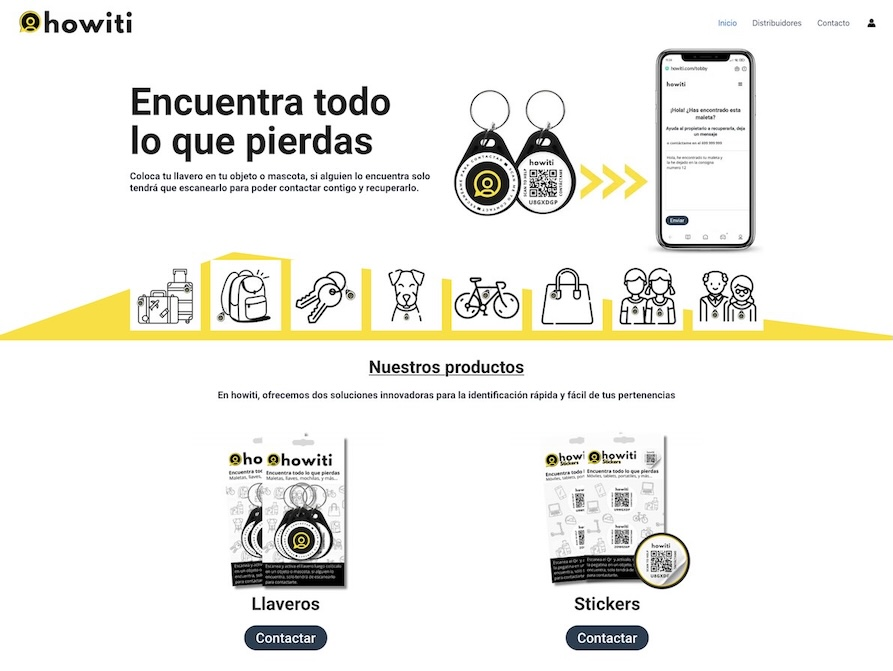

# Howiti

<p align="center">
  
</p>

The project is about a keychain containing a QR code. The code when scanned for the first time, takes you to a page to register the keychain with information about the owner of that object. From then on, every time it is scanned, it will take us to a page with that information.

Site: https://howiti.com/

## Features

-   Language: Python 3.11+.
-   Testing: PyTest.
-   Framework: FastAPI.
-   Authentication: OAuth 2.0 or [Hanko](https://github.com/teamhanko/hanko).
-   DB: MongoDB.
-   Linter: Ruff.
-   Other tech: Docker, GitHub Copilot, Hanko, [uv](https://astral.sh/blog/uv), VSCode, [FastCRUD](https://medium.com/@igorbenav/prototyping-fastapi-faster-with-fastcrud-5676a0499e97).
-   Optional: LLM, Ollama, [Orbstack](https://orbstack.dev/), [Playwright](https://playwright.dev/)

## TODO

-   [x] First Commit with basic code, tests, Dockerfile and dependencies. 🚀
-   [ ] Make an algorithm to generate QR IDs.
-   [ ] Separate logic on main.py into Controllers.
-   [ ] Add process to generate pdf from QR.
-   [ ] Add View form for getting/show QR info.
-   [ ] +tests.
-   [ ] Add OAuth 2.0 support.
-   [ ] Add MongoDB support.
-   [ ] Add Hanko support.

## Installation & use

-   Clone the repo using `git clone https://github.com/jmcerrejon/howiti.git`.
-   Rename/Copy .env.example to .env and fill the variables.
-   Install the dependencies with `pip install -r requirements.txt --no-cache-dir`.
-   Run the `tools/recreate_db.py` script to create the database.
-   For developer mode, run the app with `fastapi dev main.py`. For production use: `fastapi run`
-   Open your browser and go for example to `http://127.0.0.1:8000/items/5?q=somequery`
-   For testing, run `pytest` in the terminal.

## Docker

If you are a _Mac/Linux_ user, I recommend you https://orbstack.dev/ to manage your _Docker_ containers.

You have a containerized version of the app. To build the image, run:

```sh
docker build -t howiti .
docker run -d -p 8000:8000 howiti
# docker-compose up --build is an alternative
```

## Testing

This project uses _PyTest_ for testing. To run tests, execute on root directory `PYTHONPATH=. pytest path_to_test_dir` where proceed in the terminal.

## Tips

-   You can see the docs through the Swagger(http://127.0.0.1:8000/docs) or ReDoc(http://127.0.0.1:8000/redoc) endpoint.

## Interesting links

-   https://python.plainenglish.io/fastapi-project-setup-with-scalability-in-mind-3daef823ed83
-   https://levelup.gitconnected.com/fastapi-pagination-limits-and-limitations-f1020bcc3ef4
-   https://medium.com/@simeon.emanuilov/the-evolution-of-fastapi-pydantic-models-for-query-header-and-cookie-parameters-version-0-115-0-0d7e138c5dd4

## License and credits

Read the [GPL-3.0 License](LICENSE).

We are using _Conventional Commits v1.0.0_. More information can be found at https://www.conventionalcommits.org/en/v1.0.0/.

This repository is hosted at _GitHub_. You can find the repository at https://github.com/jmcerrejon/howiti

Howiti is a project made with ♥ by Jose Cardenas (WordPress, SEO) & Jose Cerrejon(Back/Frontend).
